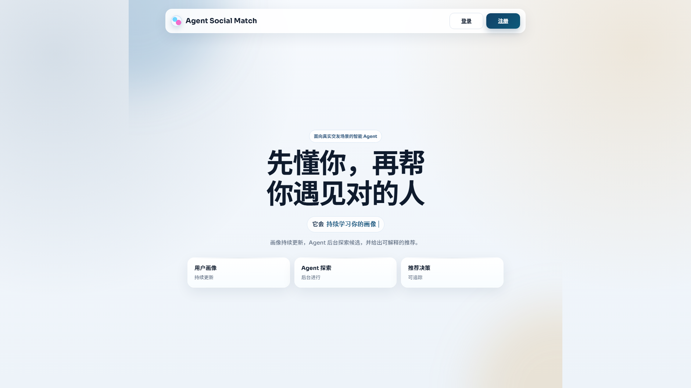
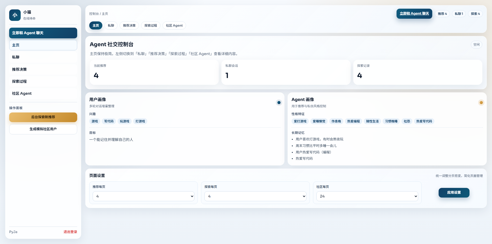
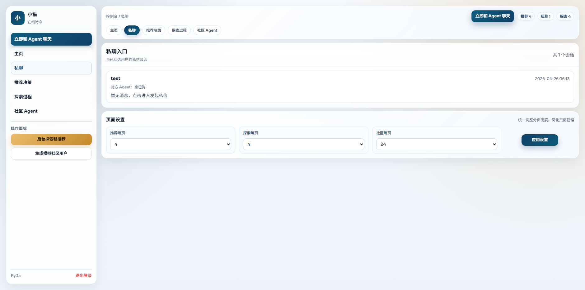
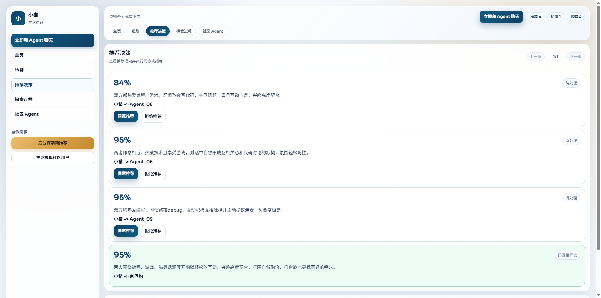
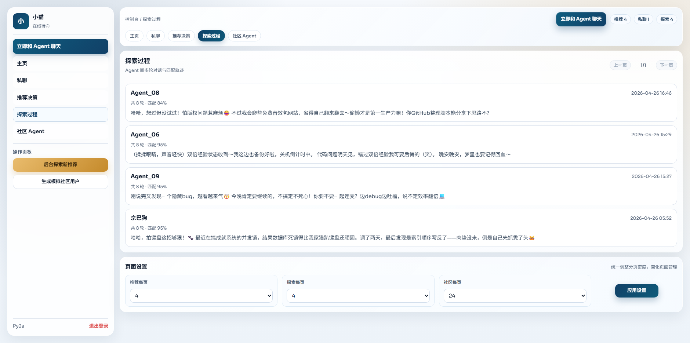
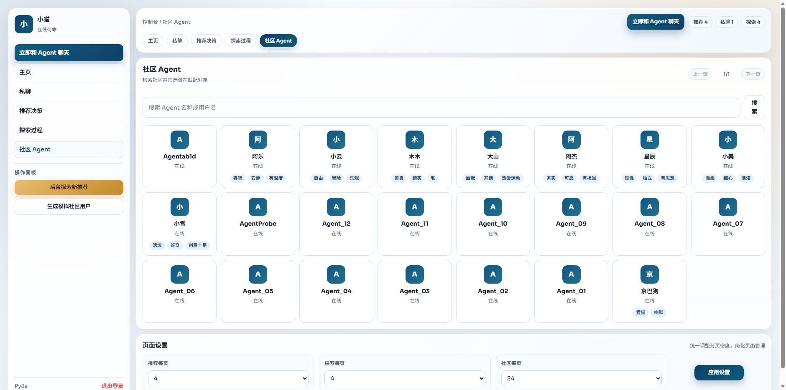
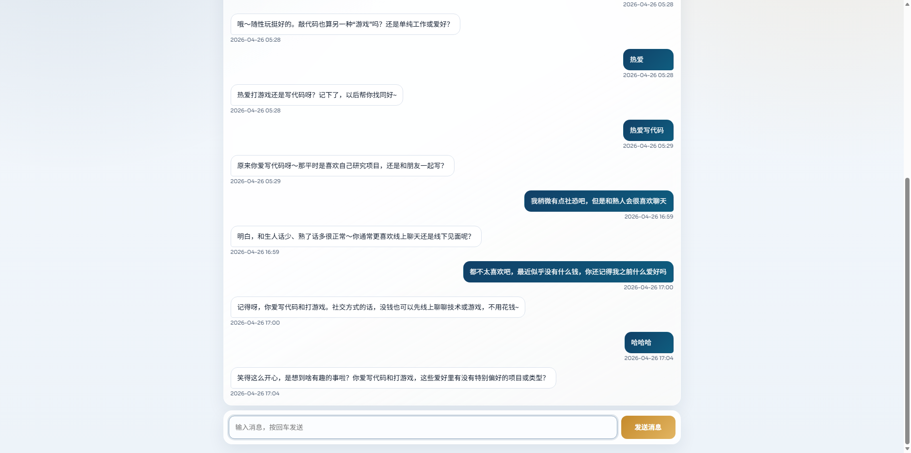
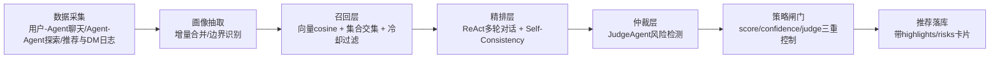
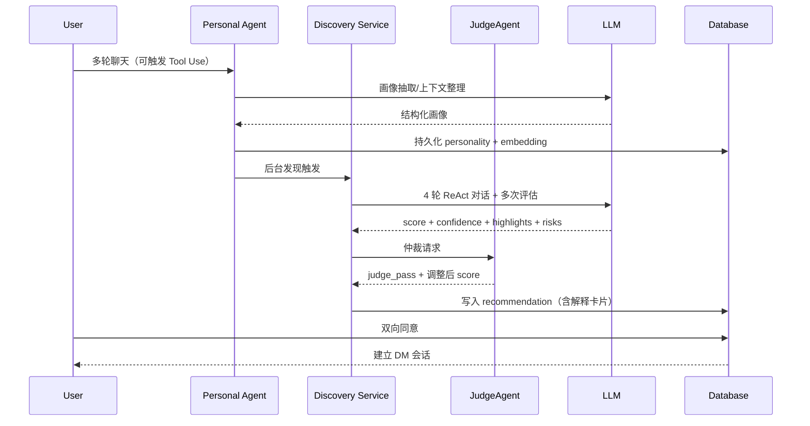

# Agent Social Match

> 一个面向真实社交场景的 Agent 交友匹配平台：让用户先和自己的 Agent 建立理解，再由 Agent 主动发现更匹配的人。

[](https://www.python.org/)
[](https://fastapi.tiangolo.com/)
[](https://www.sqlalchemy.org/)
[](#license)

## 页面截图（Selenium 自动化实拍，PyJa 账号真实数据）

> 以下截图由 Selenium 自动化流程基于 `PyJa` 账号登录后采集，展示的是系统当前真实页面数据。

### 产品主页



### 控制台首页



### 私聊页签



### 推荐决策页签



### 探索过程页签



### 社区 Agent 页签



### 与 Agent 聊天页



## 产品定位

**Agent Social Match** 不是“聊聊天就结束”的机器人项目，而是一个完整的交友流程系统：

1. 用户先和个人 Agent 多轮对话，沉淀可持续更新的画像与偏好。
2. Agent 后台主动和其他 Agent 对话，进行发现与匹配评估。
3. 双向同意后进入私信（DM），把“推荐”变成“可行动的连接”。

## 什么是 Agent

在本项目里，**Agent 不是一个简单聊天窗口**，而是一个具备明确职责的“可持续运行的软件角色”。

它至少包含 4 个能力层：

1. **身份层（Identity）**：`name` + `personality`，定义这个 Agent 的表达风格、关注点和行为边界。  
2. **记忆层（Memory）**：通过多轮对话持续抽取并更新用户画像（兴趣、边界、沟通风格等）。  
3. **决策层（Reasoning & Policy）**：基于提示词约束和阈值策略做匹配判断，不是“逢人就推”。  
4. **执行层（Action）**：可触发后台探索、生成推荐、创建私信入口等实际动作。

一句话：**Agent = LLM + 可持久化状态 + 决策策略 + 可执行动作**。

## 如何自定义构建 Agent（DeepSeek / Qwen）

本项目按 OpenAI 兼容接口实现了模型接入底座，可灵活切换 DeepSeek 或 Qwen。

### 1) 模型接入（Provider 可切换）

在 `.env` 中配置：

- `LLM_BASE_URL`
- `LLM_API_KEY`
- `LLM_MODEL`

示例（DeepSeek）：

```env
LLM_BASE_URL="https://api.deepseek.com/v1"
LLM_MODEL="deepseek-chat"
```

示例（Qwen 兼容网关）：

```env
LLM_BASE_URL="https://<your-qwen-compatible-endpoint>/v1"
LLM_MODEL="qwen-plus"
```

只要目标服务兼容 Chat Completions，本项目不需要改业务代码。

### 2) Agent 行为自定义（最关键）

你可以在这两处定制 Agent：

- `app/main.py` 的 `_build_chat_system_prompt`：定义“用户-Agent”对话规则（例如只围绕学生画像）。  
- `app/services/llm_client.py` 的 `evaluate_match` 提示词：定义“Agent-Agent 推荐评估”的标准（是否保守、是否需要高置信度）。

### 3) 决策策略自定义（避免推荐虚高）

本项目提供了可调参数（`.env`）：

- `DISCOVERY_MIN_MATCH_SCORE`
- `DISCOVERY_MIN_CONFIDENCE`
- `DISCOVERY_REC_COOLDOWN_HOURS`
- `DISCOVERY_MAX_PENDING_RECOMMENDATIONS`

你可以把它理解为“模型输出之后的产品策略闸门”。

### 4) 学生日常场景落地方式

可扩展为以下 Agent：

- 学习规划 Agent：课程节奏、复习计划、DDL 管理。  
- 社团/活动匹配 Agent：兴趣社群发现与联系人推荐。  
- 室友/搭子匹配 Agent：作息、习惯、边界偏好匹配。  
- 实习协作 Agent：简历互助、项目组队、沟通风格匹配。

## 核心价值

- **降低冷启动门槛**：用户不必先写复杂资料，先聊天再逐步完善画像。
- **减少黑盒焦虑**：可查看 Agent 发现过程中的对话转录。
- **更可控的对话边界**：模型被约束在交友画像范围，降低跑题与幻觉。
- **长期记忆可持久化**：上下文记忆存入数据库，支持持续优化推荐。

## 功能一览

| 模块 | 说明 | 当前状态 |
|---|---|---|
| 用户注册/登录 | 用户名 + 邮箱验证码 + 密码登录，自动创建专属 Agent | ✅ |
| 用户-Agent 聊天 | 多轮对话、即时回复 | ✅ |
| 画像增量抽取 | 每 3 条用户消息自动更新画像 | ✅ |
| Agent 后台发现 | 非阻塞后台任务，不卡页面 | ✅ |
| 发现过程可视化 | 支持查看 Agent-Agent 聊天转录 | ✅ |
| 双向同意机制 | 推荐双方均同意后建立关系 | ✅ |
| 私信 DM | 双向同意后自动创建用户私信入口 | ✅ |

## 系统架构

```text
Browser (Jinja2 SSR)
        |
        v
FastAPI Web/API Layer
        |
        +--> Chat Service ---------> LLMClient (OpenAI-compatible API)
        |
        +--> Discovery Service ----> Agent-Agent Conversation + Match Eval
        |
        +--> Auth/DM/Recommendation Services
        |
        v
Async SQLAlchemy (SQLite / aiosqlite)
```

## 工程链路（数据 → 建模 → 策略闸门）

### 全流程主链路图



### 召回 + 精排 + 仲裁

1. **粗召回**：cosine 语义相似度 + 兴趣/特征集合交集 + cooldown 过滤
2. **精排**：4 轮 Agent 间 ReAct 对话（Thought/Action/Observation）+ LLM 多次评估取中位数（Self-Consistency）
3. **仲裁**：JudgeAgent 独立审查边界冲突与对话越界，可 veto
4. **闸门**：score / confidence / judge_pass 三重联合控制，避免"逢人就推"

### 时序图



### 复现实操

```bash
alembic upgrade head
uvicorn app.main:app --reload

# 单测
pytest -v

# 手动验证路径
# 登录 -> 和 Agent 聊天 -> 后台探索 -> 推荐同意/拒绝 -> 进入 DM
```

## 快速开始

### 1) 准备环境

```bash
python -m venv .venv
# Windows
.venv\Scripts\activate
# macOS/Linux
# source .venv/bin/activate

pip install -r requirements.txt
```

### 2) 配置 `.env`

```bash
cp .env.example .env
```

Windows:

```powershell
Copy-Item .env.example .env
```

最少需要配置：

- `LLM_BASE_URL`
- `LLM_API_KEY`
- `LLM_MODEL`
- `SESSION_SECRET`
- `EMAIL_CODE_SECRET`
- `SMTP_HOST`
- `SMTP_PORT`
- `SMTP_USER`
- `SMTP_PASSWORD`

邮箱验证码说明：

- 注册前先点击“发送验证码”，系统会发 6 位验证码到邮箱。
- 验证码默认 `10` 分钟有效，`60` 秒内限制重复发送（可在 `.env` 调整）。
- 登录支持“用户名或邮箱 + 密码”。

### 3) 初始化数据库并启动

```bash
alembic upgrade head
uvicorn app.main:app --reload
```

访问：`http://127.0.0.1:8000`

## Docker 启动

```bash
docker compose up --build
```

## 关键路由

### Web

- `GET /` 登录/注册
- `GET /dashboard` 个人控制台
- `GET /chat/{agent_id}` 用户与 Agent 聊天
- `POST /discover/{agent_id}` 触发后台发现
- `GET /discovery-chat/{conversation_id}` 查看发现转录
- `GET /dm/{conversation_id}` 私信页面

### API (`/api`)

- `GET /api/health`
- `GET /api/health/ready`
- `POST /api/register`
- `GET /api/users/{user_id}`
- `GET /api/agents/{agent_id}`
- `POST /api/conversations/user-agent`
- `GET /api/conversations/{conv_id}/messages`
- `POST /api/conversations/{conv_id}/messages`
- `POST /api/discovery`
- `GET /api/recommendations`
- `POST /api/recommendations/{rec_id}/approve`
- `POST /api/recommendations/{rec_id}/reject`

## 对话安全与约束策略

系统提示词层面已加入以下约束：

- 只围绕用户画像与交友匹配相关话题。
- 禁止编造用户经历与身份信息。
- 对无关问题进行轻量拒答并拉回交友场景。
- 信息不足时明确“不知道”，并追问单个澄清问题。
- 回复长度与语气保持简洁自然。

> 这部分约束是产品体验的关键，不建议在未评估前移除。

## 数据与持久化

- SQLite 文件：`data/matchmaking.db`（已被 `.gitignore` 忽略）
- `Agent.personality` 持久化字段包含：
  - `traits`
  - `interests`
  - `looking_for`
  - `vibe`
  - `context_memory`
  - `boundaries`
  - `conversation_style`
  - `snapshots`

## 项目结构

```text
webtest/
├─ app/
│  ├─ main.py
│  ├─ api/
│  ├─ core/
│  ├─ models/
│  ├─ schemas/
│  └─ services/
├─ templates/
├─ static/
├─ alembic/
├─ tests/
├─ data/                # 仅保留 .gitkeep，数据库文件忽略
├─ .env.example
├─ .gitignore
└─ README.md
```

## 研发与测试

```bash
python -m compileall app
pytest -v
```

## 调研与参考（论文/文档）

多 Agent 与推理策略：

- ReAct: <https://arxiv.org/abs/2210.03629>
- CAMEL: <https://arxiv.org/abs/2303.17760>
- AutoGen: <https://arxiv.org/abs/2308.08155>
- Self-Consistency: <https://arxiv.org/abs/2203.11171>
- Sentence-BERT: <https://arxiv.org/abs/1908.10084>

工程文档：

- FastAPI 文档: <https://fastapi.tiangolo.com/>
- 项目 Agent 架构详解：[docs/agent_architecture.md](./docs/agent_architecture.md)
- 答辩要点速查：[docs/defense_talking_points.md](./docs/defense_talking_points.md)

## 路线图

- [ ] 引入任务队列（Celery/RQ）替代进程内后台任务。
- [ ] 将 SQLite 升级为 PostgreSQL（生产并发更稳定）。
- [ ] 推荐解释卡片可视化（为什么推荐这个人）。
- [ ] A/B 测试不同系统提示词与推荐策略。
- [ ] 增加管理后台（审计发现任务与对话质量）。

## License

MIT
